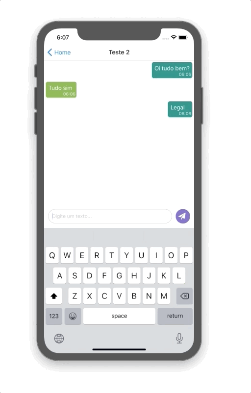

<h1 align="center">App-message-Expo</h1>
- This app was developed for testing the integration of platform Firebase with React-Native.

## 💻 About App.

- A simple app to send Messasges.

<p align="center">


</p>

<p align="center">


</p>

## 🎩 How it works

- Install dependêncies
- Requirements Expo intaled.

```sh
yarn
```

- Run the project

```sh
expo-start
```

GoodLook.
